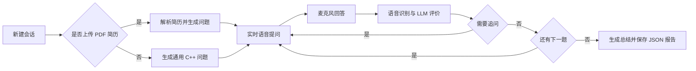

# AI Interview

从“语音面试演示”到“完整的 AI 面试训练平台”。

AI Interview 是一套面向技术岗位的智能模拟面试系统。用户可以导入自己的 PDF 简历，也可以直接使用通用题目开始练习；系统围绕一次完整面试，完成出题、作答、评价、追问、总结和报告生成。

当前仓库以 Qt 桌面端和实时语音链路为主，核心面试流程由独立的会话与面试管理模块驱动，便于后续接入文本界面、HTTP 服务和离线演示模式。

## 从语音演示到训练平台

项目的演进重点不是堆叠零散功能，而是把“参加一次面试”所需的流程、入口和工程基础组织起来：

1. 从单次语音对话扩展为包含准备、作答、评价、追问和复盘的完整闭环。
2. 从固定题目扩展为简历驱动与通用 C++ 题目并行，兼顾个性化练习和快速体验。
3. 从机械的题目列表扩展为根据回答质量决定是否追问的动态流程。
4. 将面试规则、会话状态、语音服务和 LLM 调用拆分，便于复用到文本、HTTP 和其他客户端。
5. 通过统一配置、报告格式、日志和跨平台构建脚本，提升可调试性与交付稳定性。

文本作答、HTTP 服务和无外部服务的离线演示是明确的扩展方向；它们应复用现有面试管理模块，而不是重新实现一套评分和追问规则。

## 项目亮点

### 完整的面试闭环

一次会话包含准备、开场、提问、回答、评价、追问、总结和报告保存等阶段。状态机负责协调语音播放、候选人作答、模型分析和下一题之间的切换，避免把面试流程拆成互不相关的功能按钮。

### 简历驱动与通用题目

- 选择 PDF 简历后，系统会提取简历文本，并让 LLM 根据项目经历、技能方向和技术背景生成问题。
- 不上传简历时，可以直接生成通用 C++ 技术面试题，适合快速练习和课堂演示。
- 问题数量、候选人名称和模型参数均可配置。

### 实时语音面试

项目使用 PortAudio 采集麦克风 PCM 音频，通过 WebSocket 接入实时语音对话服务，并播放面试官的 TTS 音频。默认配置适配 16 kHz 单声道输入和 24 kHz 单声道输出。

### 评价、追问与报告

LLM 负责生成问题、评价回答质量、判断是否追问，并在面试结束后生成总结。报告以 JSON 保存，包含候选人信息、面试时间、题目数量、平均分、逐题记录和总结文本，便于复盘或二次处理。

### 多入口的演进方向

当前仓库提供 Qt 桌面入口，并保留命令行入口源码。核心 `InterviewSession` 与 `DialogSession` 已按业务流程拆分，后续可在不重写面试规则的前提下接入网页端、移动端或 HTTP 服务。文本作答、离线脚本和服务端入口属于后续扩展方向。

## 工作流



## 模块结构

```text
.
├── CMakeLists.txt                 # CMake 构建配置
├── vcpkg.json                     # C++ 依赖清单
├── build.py                       # 跨平台构建辅助脚本
├── config/
│   └── default_config.json        # 默认音频、语音服务和 LLM 配置
├── include/
│   ├── common/                    # 配置、日志、协议和状态机
│   ├── interview/                 # 面试流程与会话管理
│   ├── services/                  # 语音、WebSocket、LLM、PDF 服务
│   └── ui/                        # Qt 界面
└── src/                           # 对应实现文件
```

## 环境要求

- C++17 编译器：GCC、Clang 或 MSVC
- CMake 3.20+
- Python 3.6+
- [vcpkg](https://github.com/microsoft/vcpkg)
- Qt 6（CMake 也兼容 Qt 5）
- 可用的麦克风和扬声器
- 实时语音服务凭据，以及一个 OpenAI Chat Completions 兼容的 LLM API

项目依赖由 `vcpkg.json` 管理，主要包括 Qt、Boost、OpenSSL、PortAudio、libcurl、PoDoFo、zlib、nlohmann-json 和 spdlog。

## 安装依赖

先安装并初始化 vcpkg，然后设置 `VCPKG_ROOT`：

```bash
git clone https://github.com/microsoft/vcpkg.git
cd vcpkg
./bootstrap-vcpkg.sh       # Windows 使用 bootstrap-vcpkg.bat
export VCPKG_ROOT="$PWD"
```

在项目根目录安装清单中的依赖：

```bash
"$VCPKG_ROOT/vcpkg" install --triplet x64-osx       # macOS
"$VCPKG_ROOT/vcpkg" install --triplet x64-linux     # Linux
"$VCPKG_ROOT/vcpkg" install --triplet x64-windows   # Windows
```

实际 triplet 应根据编译器和目标平台调整。

## 构建与启动

推荐使用项目提供的构建脚本：

```bash
# Release 构建（默认）
python3 build.py

# 清理后构建 Debug 版本
python3 build.py --clean --config Debug

# 构建完成后直接启动
python3 build.py --run
```

也可以直接使用 CMake：

```bash
cmake -S . -B build \
  -DCMAKE_TOOLCHAIN_FILE="$VCPKG_ROOT/scripts/buildsystems/vcpkg.cmake" \
  -DCMAKE_BUILD_TYPE=Release
cmake --build build --config Release
./build/CppInterviewSystem
```

首次启动后，在界面中点击“新建会话”，填写候选人信息，选择是否使用 PDF 简历，再点击“开始面试”。

## 配置与密钥

配置文件为 [`config/default_config.json`](config/default_config.json)，主要配置项如下：

| 配置段 | 作用 |
| --- | --- |
| `audio.input` / `audio.output` | 麦克风和扬声器的采样率、声道数、块大小 |
| `ws` | 实时语音 WebSocket 地址及认证请求头 |
| `dialog` | 面试官角色、追问策略、说话风格和 VAD 参数 |
| `tts` / `asr` | TTS 音色、输出格式和语音识别参数 |
| `llm` | OpenAI 兼容 API 地址、模型、温度、Token 上限和超时 |

请将 `ws.headers` 和 `llm.api_key` 中的占位符替换为自己的凭据。不要把真实密钥提交到 Git；建议在本地维护私有配置，并在提交前检查 `git diff` 和 `git status`。

## 报告与日志

- 面试结束后会在当前工作目录生成 `interview_report_YYYYMMDD_HHMMSS.json`。
- Qt 端日志默认写入当前工作目录的 `interview_qt.log`。
- 报告包含逐题问答和模型评价，适合面试复盘、课程验收或后续导入分析工具。

## 常见问题

**CMake 找不到 Qt 或第三方库**

确认 `VCPKG_ROOT` 指向 vcpkg 根目录，并使用与编译器匹配的 triplet；必要时删除 `build/` 后重新配置。

**启动后提示无法加载配置**

程序会依次尝试 `config/default_config.json`、`../config/default_config.json` 和 `../../config/default_config.json`。请从项目根目录启动，或确保配置文件位于上述路径之一。

**没有声音或无法连接实时语音服务**

检查系统麦克风权限、PortAudio 设备、网络连接以及 WebSocket 请求头中的服务凭据。实时语音服务和 LLM 服务属于外部依赖，服务状态可能影响面试过程。

## 适用场景与边界

项目适合个人 C++ 技术面试练习、课程实训、训练营考核、答辩演练和教学展示。AI 评分用于练习反馈和复盘参考，不应作为真实招聘决策的唯一依据。当前仓库主要验证桌面语音面试链路，文本界面、HTTP 服务、离线脚本和更多岗位模板可在现有核心模块之上继续扩展。

## 开发与贡献

欢迎围绕以下方向提交 Issue 或 Pull Request：

- 文本作答和无麦克风模式
- HTTP/API 服务与前端接入
- 离线演示和可重复测试数据
- 更多岗位、语言和评分维度
- 跨平台打包、自动化测试和 CI

提交代码前请保持 C++17 兼容，避免提交构建产物、日志文件和任何真实密钥。

## 许可证

当前仓库尚未声明正式开源许可证。如需在生产环境或其他项目中分发，请先与仓库维护者确认授权范围。
